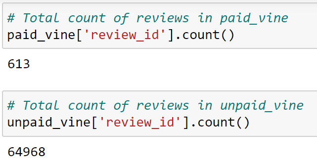
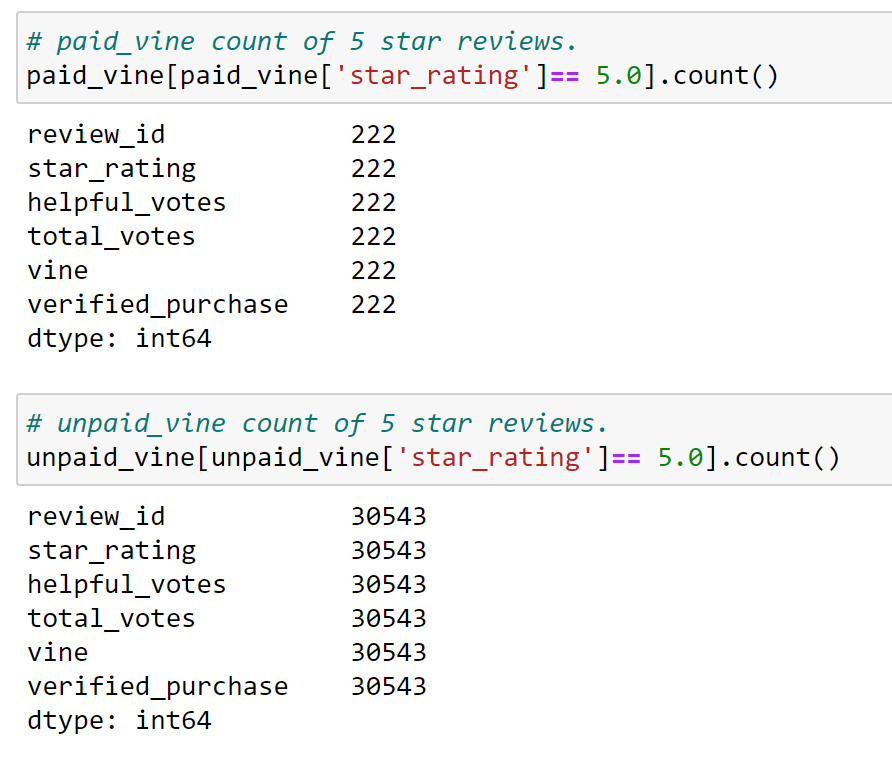
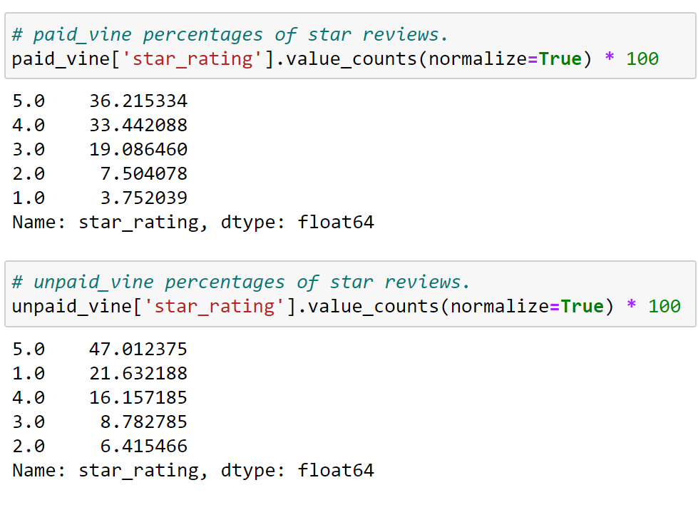

# Amazon_Vine_Analysis

## Overview 

To obtain a specific vine_review table required for further analysis, we retrieve a dataset known as amazon_reviews_us_Wireless.tsv.gz from a bucket within an RDS database within Amazon web services and import it to Amazon_Reviews_ETL.ipynb. Installation of pyspark in google collab is a necessity for the retrieval of data, formulation of tables, and methods of writing tables to postgres pgadmin. With our tables written to pgadmin4, we finally export to csv from pgadmin4. Lastly the vine_table.csv is imported to Vine_Review_Analysis.ipynb for further analysis.

## Results

* How many Vine reviews and non-Vine reviews were there?
 ** There were 613 Vine reviews and 64968 non-Vine reviews.
 
total_count

* How many Vine reviews were 5 stars? How many non-Vine reviews were 5 stars?
 ** There were 222 5-star Vine reviews and 30543 5-star non-Vine reviews.
 
count_of_5-star

* What percentage of Vine reviews were 5 stars? What percentage of non-Vine reviews were 5 stars?
 ** Both paid and unpaid vine reviews have 5-star reviews holding the largest percentage with paid_vine at 36% and unpaid_vine at 47%.

star_percentage

## Summary

Pisitivity bias surely exists with a lessenning population of reviews the more negative the rating falls sequentially. The star percentage clearly demonstrates this preference for positive feedback. An analysis to determine the average ratio of helpful_votes to total_votes for each star rating could reveal a trend of more helpful_votes to total_votes the higher the star rating becomes and would therefore further affirm the positivity bias. One such analysis is recommended.
